# 安科书架（AnkeShelf）

<p align="center">
  
</p>

面向 NGA 安科读者的跨平台阅读器：**把 NGA 帖子下载到本地 → 转换为 EPUB /
原生书 → 原汁原味还原安科排版 → 舒适阅读与追更**。支持 Windows 桌面端与
Android 手机端，两端共享同一套数据契约（书架 / 进度 / 标注 / 设置 / 统计），
分别独立开发与发布。

| 平台 | 当前版本 | 技术栈 | 发布标签 | 安装包 |
| --- | --- | --- | --- | --- |
| Windows 桌面端 | **v1.2.0** | Python + Web（前后端分离，pywebview 壳） | `vX.Y.Z` | `AnkeShelf-vX.Y.Z.zip` |
| Android 手机端 | **v1.0.0** | Kotlin + Jetpack Compose（正文用安卓专用 WebView 渲染内核） | `android-vX.Y.Z` | `AnkeShelf-vX.Y.Z-android.apk` |

> 跨平台开发日志见 [AnkeShelf_DevLog.md](AnkeShelf_DevLog.md)；两端架构说明见
> [docs/ARCHITECTURE.md](docs/ARCHITECTURE.md) 与
> [docs/ANDROID_ARCHITECTURE.md](docs/ANDROID_ARCHITECTURE.md)。

---

## ✨ 功能特性

### Windows 桌面端（v1.2.0）

- **面板下载**：顶栏「NGA 下载」→ 粘贴帖子 tid/链接，配置只看楼主（authorid）、
  前 N 楼、图片模式（嵌入 / 在线 / 不含）、明暗主题、目录楼 pid、目录用途
  （仅作索引 / 兼作分章）、每章楼层数；分阶段进度条，可随时取消，取消自动清理
- **原版视觉**：EPUB 带完整 NGA 内联样式（楼层卡片、引用块、骰子、28 种标准色、
  `[color]` 标签）；阅读器只接管排版、不强改颜色
- **连载热更新**：只拉取新增楼层并追加到本地书库，维持上次下载设置，
  进度与标注稳定
- **分页渲染**：Foliate 式 CSS multi-column 横向翻页 + 整章滚动；支持
  自动双页（横屏宽窗 / flow 同款 Auto spread）、强制双页、单页分页，
  双页自动补偶数列；长表格收纳为页内滚动
- **全文检索**：独立检索页（`Ctrl+F`），中文子串匹配、按章分组折叠、
  每章限量续取、大小写敏感、全词匹配、text_offset 精确定位跳转
- **标注系统**：选中高亮（6 色）、笔记、书签、侧栏列表跳转、导出 Markdown/JSON
- **个性化配色**：9 套预设色板 + 自定义背景 / 主题色 / 强调色 / 文字颜色；
  浅色 / 羊皮纸 / 深色 / 跟随系统主题；阅读页顶栏快速循环
- **阅读辅助**：阅读标尺、逐段阅读、速读 RSVP、自动滚动、亮度调节、
  阅读时长统计、代码高亮、键盘 / 滚轮 / 触屏翻页
- **沉浸式阅读**：F11 软件全屏，退出恢复窗口；点击页面中央切换顶 / 底栏
- **安全**：本地 HTTP 仅回环监听、随机启动令牌校验、zip 路径穿越防护、
  章节 CSP + base 注入

### Android 手机端（v1.0.0）

- **书架**：网格 / 列表双视图、按最近阅读 / 导入时间 / 名称排序、导入 EPUB、
  封面更新与导出、长按重命名 / 删除；空书架直达「导入 EPUB」或「从 NGA 下载」
- **NGA 下载与追更**：Cookie 凭据仅存本机（可一键清除）；下载 / 增量更新可
  选主题（浅 / 深）、图片（在线 / 内嵌 / 无图）、只看楼主、每章楼层数；
  前台服务进度通知，取消清理半成品；更新完成明确提示「已更新 X 楼 / 已是最新」
- **导出**：EPUB / Markdown 经系统文件选择器保存，文件名默认使用帖子原标题
- **阅读**：分页（横屏自动双页）/ 滚动两种模式；NGA 楼层卡片、引用、骰子、
  表格、彩色字体完整还原；深色 / 浅色 / 羊皮纸主题；内置霞鹜文楷字体，
  支持导入自定义字体；顶 / 底栏自动隐藏（唤出后滚动才收起）、沉浸式隐藏系统栏
- **进度精确保存**：分页按页码 + 段落记录；滚动以屏幕中线文字为锚点，
  整屏图片时按滚动比例近似恢复；换章 / 退出 / 退后台立即落盘
- **全文检索**：按章分组、每章限量 50 条可续取、大小写敏感 / 全词匹配、
  点击结果精确定位
- **标注与统计**：6 色高亮 / 笔记 / 书签 / 导出；阅读时长、会话、连续阅读统计
- **图片**：长按放大、双指缩放、可保存到自选位置（不单击误退）
- **设置**：外观 / 阅读 / 操作 / 统计 / 数据 / 帮助六个一级菜单，移动端
  大屏自动左右分栏；内置使用说明与关于信息
- **安全**：`allowBackup=false`，NGA 凭据存私有目录；WebView 仅加载本地资产
  （CSP `script-src 'self'`、禁文件访问、仅放行 https 图片）；debug 构建
  开启 StrictMode / LeakCanary 便于排障

---

## 📷 界面预览

### Android（v1.0.0 实机截图）

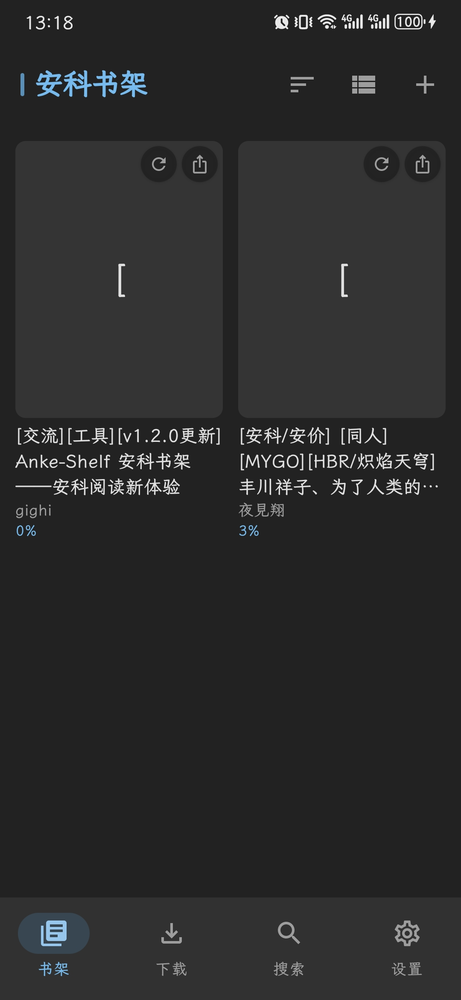
书架：网格视图、封面更新 / 导出、阅读进度

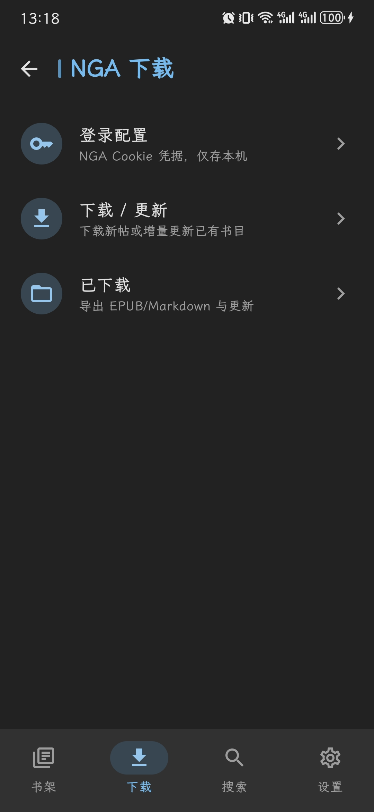
NGA 下载：登录配置、下载 / 更新、已下载管理

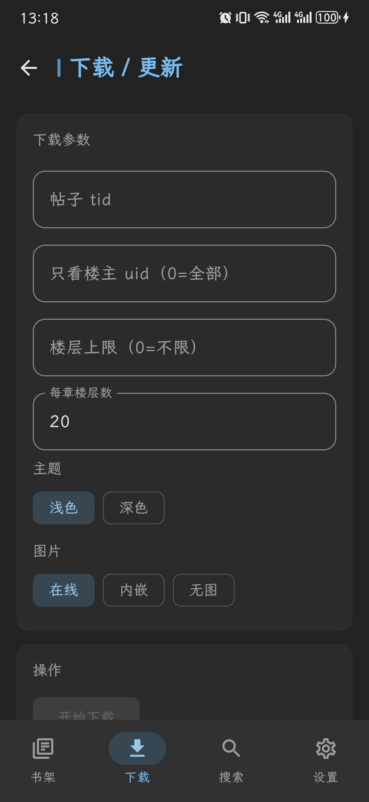
下载 / 更新：tid、只看楼主、楼层上限、每章楼层数、主题与图片模式

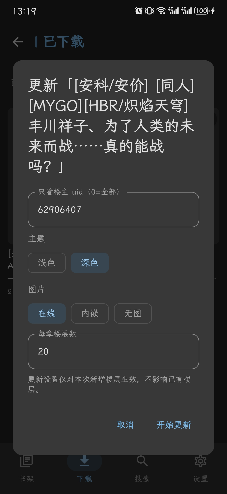
已下载页更新弹窗：增量更新参数，仅对新增楼层生效

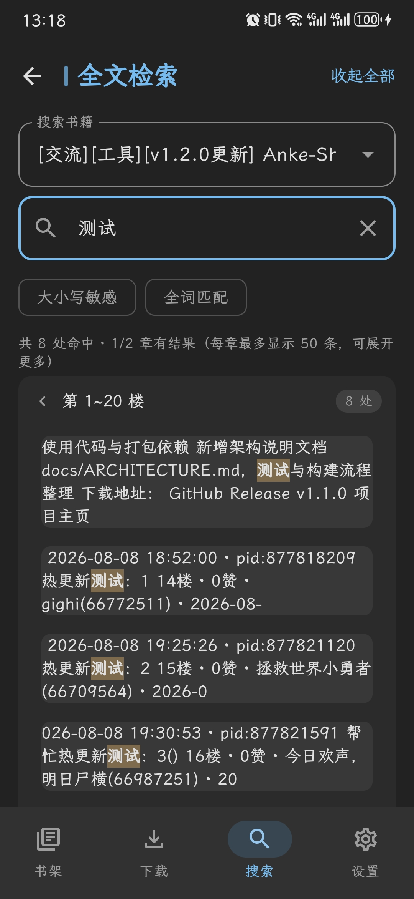
全文检索：按章分组、关键词高亮、每章限量续取

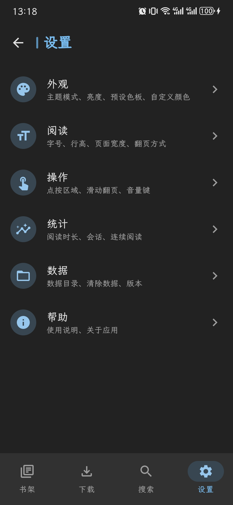
设置：外观 / 阅读 / 操作 / 统计 / 数据 / 帮助


阅读页（深色）：NGA 楼层卡片、元信息、图片与骰子排版


阅读页（浅色）：掷骰结果与插图原样还原

### Windows（v1.2.0）

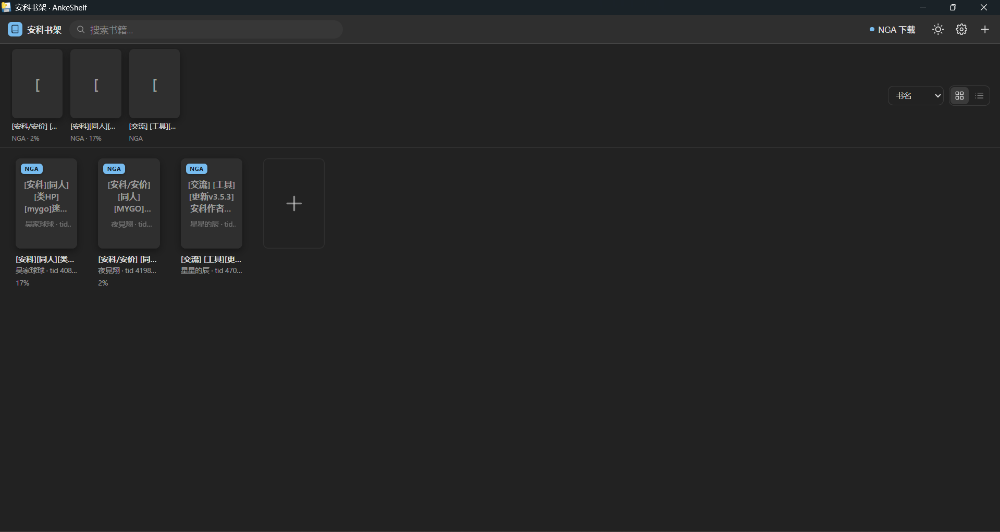
书架：网格视图、最近阅读与 NGA 下载入口


阅读页：楼层卡片、引用块与骰子结果

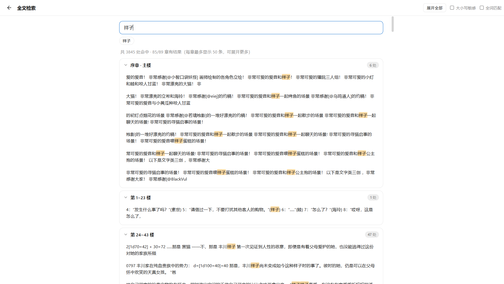
全文检索：按章分组折叠、每章限量续取

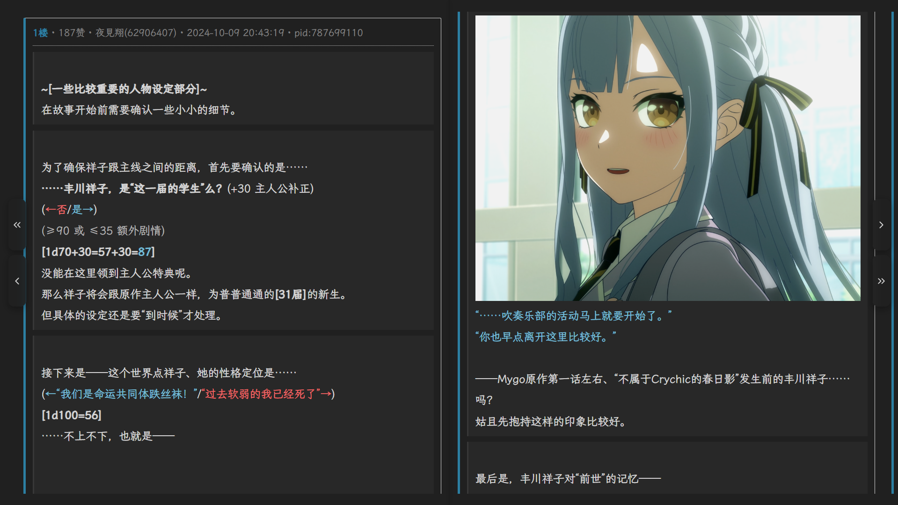
阅读页：人物设定楼与掷骰结果

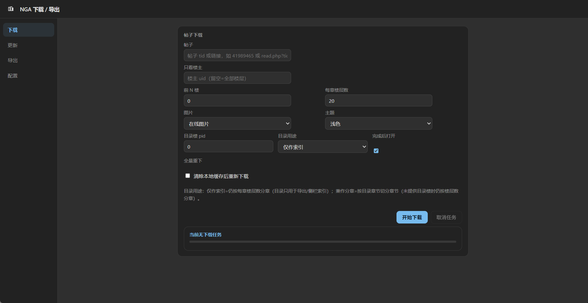
NGA 下载：下载配置与任务控制

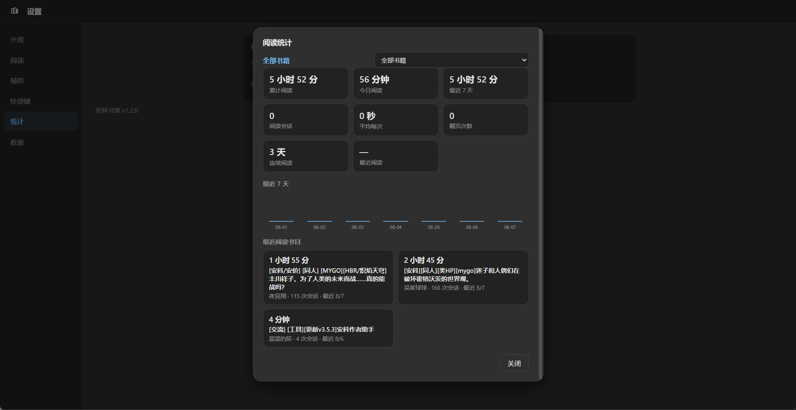
阅读统计：全部书目汇总与最近阅读时长


阅读页：楼层正文展示

---

## 🚀 安装与使用

### Windows

从 [GitHub Releases](https://github.com/gighi-947/anke-shelf/releases) 下载
`AnkeShelf-vX.Y.Z.zip`（Windows 10/11，需 Edge WebView2 Runtime，Win11 自带），
解压后运行 `AnkeShelf.exe`。

源码运行：

```bat
pip install -r requirements.txt
python -m app.main
```

打包：

```bat
pip install pyinstaller
build.bat
```

### Android

从 [GitHub Releases](https://github.com/gighi-947/anke-shelf/releases) 下载
`AnkeShelf-v1.0.0-android.apk`（Android 8.0+ / API 26+）安装。

源码构建：

```bat
cd android
gradlew.bat assembleDebug        :: 调试包
gradlew.bat assembleRelease      :: 签名发布包（需本地 android/keystore/ 签名）
```

> 首次安装系统可能提示“未知来源应用”，允许本次安装即可；应用不需要任何
> 敏感权限，数据全部保存在应用私有目录。

### NGA Cookie（下载登录内容需要）

安卓端与 Windows 端获取方式相同：

1. 浏览器打开 <https://bbs.nga.cn> 并登录；
2. `F12` →「应用程序 / 存储」→ Cookies → `https://bbs.nga.cn`；
3. 复制 `ngaPassportUid`（数字 ID）与 `ngaPassportCid`（会话凭证）；
4. 安卓在「下载 → 登录配置」、Windows 在「NGA 下载 → 配置」中粘贴保存。

凭据只保存在本机（安卓为应用私有目录、Windows 为 `%APPDATA%\AnkeShelf\`），
不会上传到任何服务器，仓库与发行包均不含真实凭据；Cookie 过期时按上述步骤
重新复制即可，需要清理时点「清除已保存配置」。

---

## 🧪 测试

### Windows

```bat
python -m tests.make_test_epub            :: 生成测试样本到 tests\sample\
python -m unittest discover tests         :: 单元测试
python -m tests.ui.runner                 :: UI 自动化（需桌面会话）
python -m tests.ui.verify_nga_real        :: 真实 NGA 书端到端（需网络，可选）
```

### Android

```bat
cd android
gradlew.bat testDebugUnitTest             :: JVM 单元测试（数据层 / 进度 / 搜索 / 渲染对照）
gradlew.bat compileDebugAndroidTestKotlin :: 仪器测试编译
```

真机手工验收参照 [docs/ANDROID_M4_ACCEPTANCE.md](docs/ANDROID_M4_ACCEPTANCE.md)；
进度保持回归要求“滚动 / 翻页 → 退出 → 重进”位置一致，连续重进 3 次一致。

---

## 🏗️ 架构

- **Windows**：前后端分离。Python 侧提供本地 HTTP 服务与数据存储（EPUB 解析、
  书架 / 进度 / 标注 / 统计、全文索引、NGA 下载与热更新）；Web 侧为纯静态
  单页应用（渲染 / 交互）；pywebview 仅作窗口壳。章节经 iframe 加载，阅读器
  注入排版而不改动书源。详见 [docs/ARCHITECTURE.md](docs/ARCHITECTURE.md)。
- **Android**：Kotlin + Jetpack Compose 单模块 `:app`，MVVM + 手动 DI。
  Compose 外壳负责书架 / 下载 / 搜索 / 设置 / 统计与阅读页 UI；正文由
  **安卓专用精简 WebView 渲染内核**（`assets/reader/reader-lite.js`）负责
  分页 / 滚动 / NGA 楼层样式与 text_offset 映射；进度经 `ChapterProgressTracker`
  单一入口落盘。数据契约与桌面端 JSON schema 同构，存
  `filesDir/AnkeShelf/`。详见
  [docs/ANDROID_ARCHITECTURE.md](docs/ANDROID_ARCHITECTURE.md) 与
  [android/README.md](android/README.md)。

## 📦 版本与发布

- **版本线分离**：Windows 用 `vX.Y.Z`（当前 v1.2.0）；Android 用
  `android-vX.Y.Z`（当前 v1.0.0），唯一版本定义在
  `android/app/build.gradle.kts`。
- **标签与资产**：`vX.Y.Z` + `AnkeShelf-vX.Y.Z.zip`；`android-vX.Y.Z` +
  `AnkeShelf-vX.Y.Z-android.apk`（资产名纯 ASCII）。
- **发布流程**：Windows 与 Android 各有独立 SOP（安卓见
  [android/VERSIONING.md](android/VERSIONING.md)），互不混用。

## 目录结构

```text
app/                  Windows Python 服务层（解析 / 书架 / 搜索 / 标注 / NGA 下载 / HTTP API）
web/                  Windows 前端单页应用（书架 + 阅读器）
ngapost2md-python/    NGA 帖子下载与转换内核（EPUB / Markdown 生成，config.ini 不入库）
android/              Android 端 Kotlin + Compose 工程（独立版本线）
tests/                Windows 单元测试与 UI 自动化
docs/                 架构说明、验收报告与双端截图
```

## 设计参考与开源致谢

开发过程中参考了多个优秀的开源项目。**“思路借鉴”指参考其设计、交互与架构后
独立实现；凡直接对照算法、几何公式或数据结构的地方，源码注释中均已标注出处。**

| 项目 | 许可证 | 借鉴内容 |
| --- | --- | --- |
| [Readest](https://github.com/readest/readest) | AGPL-3.0 | 前后端分离架构、EPUB 解析流水线、主题设计令牌、浮动顶 / 底栏、搜索历史、进度防抖与去重 |
| [flow](https://github.com/pacexy/flow) | AGPL-3.0 | 自动双页、CSS multi-column 分页几何、双页补偶数列、搜索分组折叠 |
| [epub.js](https://github.com/futurepress/epub.js) | BSD-2-Clause | 分页列几何（列宽 / 沟槽计算）、Auto spread、forceEvenPages 思路 |
| [Foliate](https://github.com/johnfactotum/foliate) | GPL-3.0-or-later | CSS multi-column 分页思路、大小写敏感 / 全词匹配搜索选项 |
| [Koodo Reader](https://github.com/koodo-reader/koodo-reader) | AGPL-3.0 | 设置页 Tab 导航、色板选择、搜索结果分页与跳转 |
| [KOReader](https://github.com/koreader/koreader) | AGPL-3.0 | 主题预设色板、日 / 夜自定义配色思路 |
| [Legado](https://github.com/gedoor/legado) | GPL-3.0 | Android 阅读器章节内进度字段语义（durChapterPos）、onPause 保存时机 |
| [daisyUI](https://github.com/saadeghi/daisyui) | MIT | 以 CSS 变量组织设计令牌的 UI 思路 |
| [ngapost2md](https://github.com/ludoux/ngapost2md) | 以原仓库 LICENSE 为准 | `ngapost2md-python/` 为其 Python 重写版，下载流程、数据模型与格式规则等价；表情与匿名映射表由 Go 源码提取 |
| [霞鹜文楷 LXGW WenKai](https://github.com/lxgw/LxgwWenKai) | SIL OFL 1.1 | 内置默认阅读字体，许可证见 `web/fonts/OFL.txt` 与安卓 `assets/fonts/OFL.txt` |

本项目自身代码以 [GNU AGPL-3.0](LICENSE) 开源。

## License

[GNU AGPL-3.0](LICENSE) © gighi-947
